# woo-hoo

> Let the ghost fill in your metadata 👻

LLM-powered DIWOO metadata generation for Dutch government documents under the Wet open overheid (Woo).

## Features

- **DIWOO-compliant**: Generates metadata conforming to the [DIWOO XSD schema](https://standaarden.overheid.nl/diwoo/metadata/0.9.8/xsd/diwoo/diwoo-metadata.xsd) (v0.9.8)
- **XML-first**: LLM generates XML internally, parsed and validated against schema, returned as JSON
- **Smart extraction**: Extracts identifiers (kenmerk, zaaknummer), organizations, dates, and document relationships
- **17 Woo Categories**: Automatically classifies documents into the 17 information categories from Artikel 3.3 Woo
- **Flexible models**: Default Mistral Large (EU-based) for data sovereignty, or use any OpenRouter model
- **Confidence scoring**: Returns confidence scores for each extracted field
- **Standalone & Integrable**: Works independently or integrates with GPP-app/GPP-publicatiebank
- **FastAPI + CLI**: HTTP API and command-line interface

## Quick Start

### Prerequisites

- Python 3.12+
- [uv](https://docs.astral.sh/uv/) package manager
- [just](https://just.systems/) command runner
- OpenRouter API key ([get one here](https://openrouter.ai/keys))

### Installation

```bash
# Clone and enter the repo
cd woo-hoo

# Install dependencies
just install

# Copy env file and add your API key
cp .env.example .env
# Edit .env and add your LLM_API_KEY
```

### Usage

**Start the API server:**

```bash
just dev
# API available at http://localhost:8000
# Swagger docs at http://localhost:8000/docs
```

**Generate metadata from CLI:**

```bash
# From a text file
uv run woo-hoo generate document.txt --publisher "Gemeente Amsterdam"

# From a PDF
uv run woo-hoo generate besluit.pdf --output metadata.json

# List all Woo categories
uv run woo-hoo categories
```

**Generate via API:**

```bash
curl -X POST http://localhost:8000/api/v1/metadata/generate \
  -H "Content-Type: application/json" \
  -d '{
    "document": {
      "text": "Geachte heer/mevrouw, Hierbij ontvangt u ons advies..."
    },
    "publisher_hint": {
      "name": "Gemeente Amsterdam"
    }
  }'
```

## API Endpoints

| Method | Path | Description |
|--------|------|-------------|
| `POST` | `/api/v1/metadata/generate` | Generate metadata from text |
| `POST` | `/api/v1/metadata/generate-from-file` | Generate from uploaded file |
| `POST` | `/api/v1/metadata/generate-from-publicatiebank` | Generate from publicatiebank document UUID |
| `POST` | `/api/v1/metadata/validate` | Validate metadata |
| `GET` | `/api/v1/metadata/categories` | List 17 Woo categories |
| `GET` | `/api/v1/metadata/openrouter-models` | List recommended OpenRouter models |
| `GET` | `/health` | Health check |
| `GET` | `/ready` | Readiness check |
| `GET` | `/docs` | Swagger UI |

### Model Selection

By default, Mistral Large (EU-based) is used for data sovereignty compliance when using OpenRouter. The `/openrouter-models` endpoint lists recommended models with EU-based models prioritized first. Custom LLM providers use their own model names (e.g., `mistral:latest` for Ollama).

#### EU-Based Models (Recommended for Dutch Government)

Mistral AI models are hosted in the EU (France) and are recommended for GDPR/data sovereignty compliance:

| Model | ID | Description |
| ----- | -- | ----------- |
| Mistral Large | `mistralai/mistral-large-2512` | Best quality, 675B MoE (default) |
| Mistral Medium | `mistralai/mistral-medium-3.1` | Good balance of quality and cost |
| Mistral Small | `mistralai/mistral-small-3.2-24b-instruct-2506` | Fast and cost-effective |
| Mistral Nemo | `mistralai/mistral-nemo` | Lightweight, fast |

#### Non-EU Models (Warning: Data Sovereignty)

> **Warning**: Non-EU models may transfer data to US servers. Use only if EU data sovereignty is not a requirement.

OpenAI, Anthropic, and Google models are available but hosted outside the EU.

```bash
# Using default Mistral Large (EU-based)
curl -X POST http://localhost:8000/api/v1/metadata/generate \
  -H "Content-Type: application/json" \
  -d '{"document": {"text": "..."} }'

# Using a specific EU model
curl -X POST http://localhost:8000/api/v1/metadata/generate \
  -H "Content-Type: application/json" \
  -d '{"document": {"text": "..."}, "model": "mistralai/mistral-medium-3.1"}'

# Using a non-EU model (use with caution)
curl -X POST http://localhost:8000/api/v1/metadata/generate \
  -H "Content-Type: application/json" \
  -d '{"document": {"text": "..."}, "model": "anthropic/claude-4.5-sonnet-20250929"}'

# List recommended OpenRouter models (EU models listed first)
curl http://localhost:8000/api/v1/metadata/openrouter-models
```

## The 17 Woo Information Categories

| Code | Category | Article |
|------|----------|---------|
| WETTEN_AVV | Wetten en algemeen verbindende voorschriften | 3.3.1a |
| OVERIGE_BESLUITEN_AS | Overige besluiten van algemene strekking | 3.3.1b |
| ONTWERPEN_REGELGEVING | Ontwerpen van regelgeving | 3.3.1c |
| ORGANISATIE_WERKWIJZE | Organisatie en werkwijze | 3.3.1d |
| BEREIKBAARHEID | Bereikbaarheidsgegevens | 3.3.1e |
| INGEKOMEN_STUKKEN | Ingekomen stukken | 3.3.2a |
| VERGADERSTUKKEN_SG | Vergaderstukken Staten-Generaal | 3.3.2b |
| VERGADERSTUKKEN_DECENTRAAL | Vergaderstukken decentraal | 3.3.2c |
| AGENDAS_BESLUITENLIJSTEN | Agenda's en besluitenlijsten | 3.3.2d |
| ADVIEZEN | Adviezen | 3.3.2e |
| CONVENANTEN | Convenanten | 3.3.2f |
| JAARPLANNEN_JAARVERSLAGEN | Jaarplannen en jaarverslagen | 3.3.2g |
| SUBSIDIES_ANDERS | Subsidieverplichtingen | 3.3.2h |
| WOO_VERZOEKEN | Woo-verzoeken en -besluiten | 3.3.2i |
| ONDERZOEKSRAPPORTEN | Onderzoeksrapporten | 3.3.2j |
| BESCHIKKINGEN | Beschikkingen | 3.3.2k |
| KLACHTOORDELEN | Klachtoordelen | 3.3.2l |

## Docker

```bash
# Build and run
just docker-build
just docker-run

# Or with docker-compose
docker compose up woo-hoo

# Development mode with hot reload
docker compose --profile dev up woo-hoo-dev

# Run tests in Docker
docker compose --profile test up test
```

## Kubernetes Deployment

### Local (Minikube)

```bash
# Setup secrets
cp deploy/local/secrets.env.example deploy/local/secrets.env
# Edit secrets.env with your LLM_API_KEY

# Deploy
just deploy-local

# Add to /etc/hosts
echo "$(minikube ip) woo-hoo.local" | sudo tee -a /etc/hosts

# Access
curl http://woo-hoo.local/health

# Delete
just deploy-local-delete
```

### Production

```bash
# Create secret from environment
kubectl create secret generic woo-hoo-secrets \
  --from-literal=LLM_API_KEY=$LLM_API_KEY \
  --from-literal=GPP_API_TOKEN=$GPP_API_TOKEN

# Deploy with Helm
helm install woo-hoo ./charts/woo-hoo \
  -f deploy/values-production.yaml

# Or from GitHub Container Registry
helm install woo-hoo ./charts/woo-hoo \
  --set image.repository=ghcr.io/gpp-woo/woo-hoo \
  --set image.tag=0.1.0 \
  --set existingSecret=woo-hoo-secrets
```

See [deploy/values-production.yaml.example](deploy/values-production.yaml.example) for full configuration options.

## Development

```bash
# Run tests
just test

# Run linter
just lint

# Format code
just format

# Type check
just typecheck
```

### Testing with Real Documents

Download sample documents from open.overheid.nl and test with real API calls:

```bash
# Download sample PDFs
just download-samples

# Test all samples (XML mode - default)
just test-real

# Test a single file
just test-real-single
just test-real-single path/to/doc.pdf

# Show the system prompt sent to the LLM
just show-prompt
```

## Configuration

Environment variables (see `.env.example`):

| Variable | Description | Default |
| --- | --- | --- |
| `LLM_API_KEY` | API key for the selected provider | (required*) |
| `LLM_PROVIDER` | LLM provider: `openrouter`, `anthropic`, or `custom` | `openrouter` |
| `DEFAULT_MODEL` | LLM model | `mistralai/mistral-large-2512` |
| `FALLBACK_MODEL` | Fallback LLM model | `mistralai/mistral-small-3.2-24b-instruct-2506` |
| `ANTHROPIC_BASE_URL` | Anthropic API base URL (for proxies) | `https://api.anthropic.com` |
| `CUSTOM_LLM_BASE_URL` | Custom LLM endpoint URL | (required for custom) |
| `LOG_LEVEL` | Logging level | `INFO` |
| `LOG_FORMAT` | Log format (`json` or `console`) | `json` |
| `MAX_TEXT_LENGTH` | Max document length | `15000` |
| `GPP_PUBLICATIEBANK_URL` | Publicatiebank API URL | (optional) |
| `GPP_API_TOKEN` | Publicatiebank API token | (optional) |

\* Not required for `custom` provider without auth (e.g., local Ollama).

## Architecture & Data Sovereignty

### System Overview


### Data Sovereignty Options

```mermaid
graph LR
    subgraph gemeente["Gemeente Netwerk"]
        app["woo-hoo"]
        ollama["Ollama / vLLM<br/><b>Lokale LLM</b>"]
    end

    subgraph internet["Internet"]
        openrouter["OpenRouter<br/><i>openrouter.ai</i>"]
        anthropic_api["Anthropic API<br/><i>Direct, no middleman</i>"]
    end

    subgraph cloud["Cloud"]
        mistral["Mistral AI<br/><i>EU 🇪🇺</i>"]
        openai["OpenAI<br/><i>VS 🇺🇸</i>"]
        claude_cloud["Claude<br/><i>VS 🇺🇸</i>"]
    end

    app -->|"Optie A: OpenRouter<br/>────────────────<br/>✅ 30+ modellen<br/>✅ Geen GPU nodig<br/>⚠️ Via OpenRouter infra<br/>⚠️ Data verlaat netwerk"| openrouter
    openrouter --> mistral
    openrouter --> openai

    app -->|"Optie B: Anthropic direct<br/>────────────────<br/>✅ Geen middleman<br/>✅ Direct naar Anthropic<br/>⚠️ Data verlaat netwerk<br/>⚠️ Alleen Claude modellen"| anthropic_api
    anthropic_api --> claude_cloud

    app -->|"Optie C: Lokale LLM<br/>────────────────<br/>✅ Data blijft intern<br/>✅ Volledige controle<br/>⚠️ GPU hardware nodig<br/>⚠️ Zelf model beheren"| ollama

    style ollama fill:#4caf50,stroke:#388e3c,color:#fff
    style openrouter fill:#f5a623,stroke:#d4831f,color:#000
    style anthropic_api fill:#d4a574,stroke:#b8860b,color:#000
    style mistral fill:#2196f3,stroke:#1976d2,color:#fff
    style openai fill:#ff5722,stroke:#d84315,color:#fff
    style claude_cloud fill:#d4a574,stroke:#b8860b,color:#000
    style gemeente fill:#e8f5e9,stroke:#4caf50
```



### Internal Provider Routing


For a data sovereignty comparison table, see [docs/architecture.md](docs/architecture.md).

### LLM Providers

woo-hoo supports three LLM providers, configurable via `LLM_PROVIDER`:

| Provider | `LLM_PROVIDER` | Use case |
| --- | --- | --- |
| **OpenRouter** | `openrouter` (default) | 30+ models, no GPU needed, pay-per-use |
| **Anthropic** | `anthropic` | Direct Anthropic API access (Claude models) |
| **Custom / Local** | `custom` | Self-hosted LLM (Ollama, vLLM, LocalAI, etc.) |

**Data sovereignty**: For municipalities requiring all data to stay internal, use a local LLM:

```bash
LLM_PROVIDER=custom
CUSTOM_LLM_BASE_URL=http://ollama:11434/v1   # your local endpoint
DEFAULT_MODEL=mistral:latest                   # model name on your server
```

Or use Anthropic directly (bypassing OpenRouter):

```bash
LLM_PROVIDER=anthropic
LLM_API_KEY=sk-ant-...
DEFAULT_MODEL=claude-sonnet-4-20250514
```

### Authentication

`LLM_API_KEY` is the single API key for whichever provider you choose. The code handles auth automatically:

| Provider | How `LLM_API_KEY` is sent |
| --- | --- |
| `openrouter` | Passed to OpenRouter SDK |
| `anthropic` | Sent as `x-api-key` header |
| `custom` | Sent as `Authorization: Bearer <key>` |
| `custom` (no key) | No auth headers (e.g., local Ollama) |

> **Tip**: Most local LLM servers (Ollama, vLLM, LocalAI, llama.cpp) provide an OpenAI-compatible API, so they work out of the box with the `custom` provider.

### Per-Request Overrides

All three generation endpoints (`/generate`, `/generate-from-file`, `/generate-from-publicatiebank`) accept optional per-request `api_key` and `custom_base_url` parameters. This allows callers to override the server-configured LLM provider on a per-request basis — useful for multi-tenant setups or letting users bring their own API key.

```bash
# Override LLM provider per request (e.g., use a local Ollama)
curl -X POST http://localhost:8000/api/v1/metadata/generate \
  -H "Content-Type: application/json" \
  -d '{
    "document": {"text": "Geachte heer/mevrouw..."},
    "api_key": "my-openrouter-key",
    "custom_base_url": "http://my-ollama:11434/v1",
    "model": "mistral:latest"
  }'

# File upload with per-request override
curl -X POST http://localhost:8000/api/v1/metadata/generate-from-file \
  -F "file=@besluit.pdf" \
  -F "api_key=my-openrouter-key" \
  -F "custom_base_url=http://my-ollama:11434/v1" \
  -F "model=mistral:latest"
```

When a per-request `api_key` is provided, it bypasses the server-side API key check (so the server doesn't need `LLM_API_KEY` configured for that request).

### Project Structure

```text
woo-hoo/
├── src/woo_hoo/
│   ├── api/           # FastAPI endpoints
│   ├── models/        # Pydantic models (DIWOO schema, enums)
│   ├── services/      # Business logic (OpenRouter, XML parsing, publicatiebank)
│   ├── instructions/  # TOML config for LLM prompts
│   ├── schemas/       # XSD schema for validation
│   └── cli.py         # Typer CLI
├── charts/woo-hoo/    # Helm chart for Kubernetes
├── deploy/
│   ├── local/         # Local minikube deployment
│   └── values-*.yaml  # Production values examples
├── scripts/           # E2E testing scripts
├── tests/
│   ├── unit/          # Model tests
│   └── integration/   # API e2e tests
├── Dockerfile         # Multi-stage Docker build
├── docker-compose.yml # Local development
└── justfile           # Common tasks
```

## Integration with GPP

This service is designed to integrate with:

- **GPP-app**: C#/.NET frontend for document management
- **GPP-publicatiebank**: Django backend for document storage

### Publicatiebank Integration

Generate metadata directly from documents stored in GPP-publicatiebank:

```bash
# Configure publicatiebank URL
export GPP_PUBLICATIEBANK_URL=http://gpp-publicatiebank:8000

# Generate metadata from a document UUID
curl -X POST "http://localhost:8000/api/v1/metadata/generate-from-publicatiebank?document_uuid=550e8400-e29b-41d4-a716-446655440000"
```

The generated metadata follows the same DIWOO structure used by these applications.

## License

MIT

## References

- [DIWOO Metadata Standard](https://standaarden.overheid.nl/diwoo/metadata/) - Main documentation
- [DIWOO XSD Schema v0.9.8](https://standaarden.overheid.nl/diwoo/metadata/doc/0.9.8/metadata-xsd.html) - XML Schema documentation
- [XSD Usage Guide](https://standaarden.overheid.nl/diwoo/metadata/diwoo-metadata-gebruik) - How to use the XSD
- [Woo Informatiecategorieën](https://www.open-overheid.nl/onderwerpen/openbaar-maken/woo-informatiecategorieen-en-definities) - The 17 categories
- [TOOI Thesaurus](https://identifier.overheid.nl/tooi/) - Controlled vocabularies
- [OpenRouter](https://openrouter.ai/) - LLM API provider
